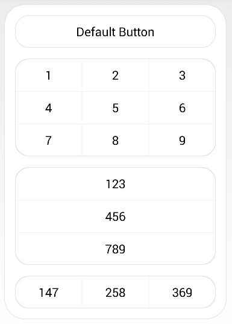
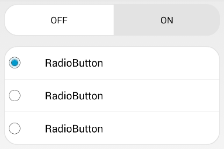

Rounded-UI
==========

This is a set of rounded, customizable UI elements for Android. This includes a background container, buttons (in a 9x9 grid), toggle buttons, and can be extended to be used with almost any other elements in Android.

This does not use images to create the button; it uses shapes, and therefore, it can easily be customized within the app, just with a change in a single file.

Screenshots
----

Set-up
----

Please copy all the files and subfolders in /res into your application's /res folder.

Usage
----

To use Rounded-UI elements, add `android:background="@drawable/<item name>"` to your UI element such as buttons.

Replace `<item name>` according to the shape you wish to use (in the example image above):

- Container: `rounded_container`
- Default Button: `rounded_button_default`
- Button Number 1: `rounded_button_1`
- Button Number 2: `rounded_button_2`
- Button Number 3: `rounded_button_3`
- Button Number 4: `rounded_button_4`
- Button Number 5: `rounded_button_5`
- Button Number 6: `rounded_button_6`
- Button Number 7: `rounded_button_7`
- Button Number 8: `rounded_button_8`
- Button Number 9: `rounded_button_9`
- Button Number 123: `rounded_button_123`
- Button Number 456: `rounded_button_456`
- Button Number 789: `rounded_button_789`
- Button Number 147: `rounded_button_147`
- Button Number 258: `rounded_button_258`
- Button Number 369: `rounded_button_369`

For toggle buttons, please add `_toggle` to the end of the `<item name>` above.

Also, please specify the height: `android:layout_height="50dp"` or the UI Elements will look compressed in older Android versions.

To customize the radius, color, border color, etc., please change the values in the /res/values/rounded_values.

Example
----

`<Button
	android:id="@+id/button"
	android:layout_width="wrap_content"
	android:layout_height="50dp"
	android:background="@drawable/rounded_button_default"
	android:text="Button" />`

The following code will create the Default Button.

Copyright and Licensing
----

Copyright © 2014 Provectium. All rights reserved.

This is disributed under an Apache 2.0 License.
